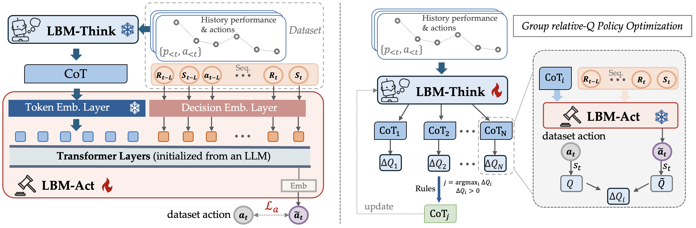
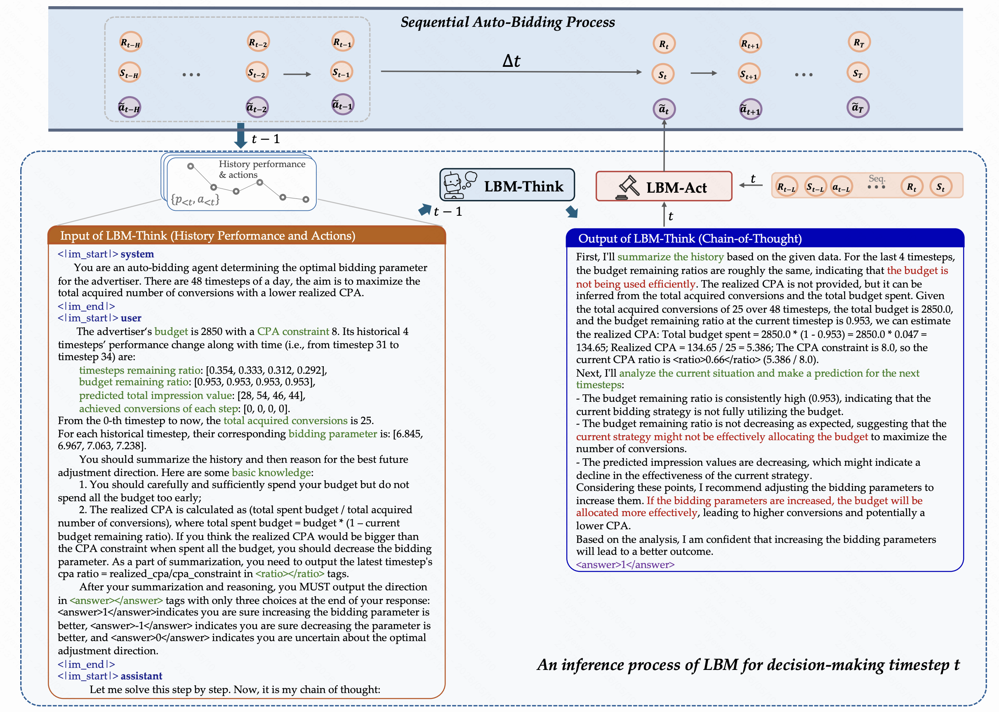
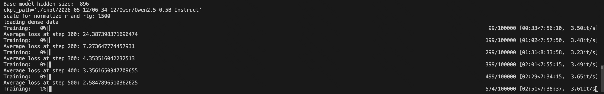
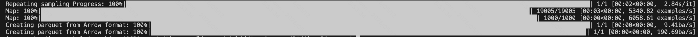

<h1 align="center">
  <br>
  LBM: Hierarchical Large Auto-Bidding Model
via Reasoning and Acting
</h1>


<p align="center">
  <a href="https://arxiv.org/pdf/2603.05134"></a>
</p>

## 📝 Introduction
We propose a hierarchical Large auto-Bidding
Model (LBM) to leverage the reasoning capabilities of LLMs for developing a superior auto-bidding strategy, including a high-level LBM-Think model for reasoning and a low-level LBM-Act model for action generation. 

<p align="center">
    
   
</p>


## 💾 Installation

This codebase is relying on AuctionNet and Llama-Factory.
### Python Environment
```
conda create -n lbm python=3.9
# install vllm
pip3 install vllm==0.6.3
# flash attention 2
pip3 install flash-attn --no-build-isolation
# quality of life
pip install wandb IPython matplotlib
```

### Prepare the Datasets
The datasets could be downloaded from the [NeurIPS 2024 Competition Auto-Bidding in Large-Scale Auctions (AIGB dataset, which is preprocessed from the AuctionNet vanilla data by Alibaba)](https://tianchi.aliyun.com/competition/entrance/532236/rankingList).
We express our utmost respect for their tremendous contributions to the auto-bidding and computational advertising community!
#### 1) AuctionNet Dataset
```
https://alimama-bidding-competition.oss-cn-beijing.aliyuncs.com/share/autoBidding_aigb_track_data_period_7-8.zip
https://alimama-bidding-competition.oss-cn-beijing.aliyuncs.com/share/autoBidding_aigb_track_data_period_9-10.zip
https://alimama-bidding-competition.oss-cn-beijing.aliyuncs.com/share/autoBidding_aigb_track_data_period_11-12.zip
https://alimama-bidding-competition.oss-cn-beijing.aliyuncs.com/share/autoBidding_aigb_track_data_period_13.zip
https://alimama-bidding-competition.oss-cn-beijing.aliyuncs.com/share/autoBidding_aigb_track_data_trajectory_data.zip
https://alimama-bidding-competition.oss-cn-beijing.aliyuncs.com/share/autoBidding_aigb_track_data_trajectory_data_extended_1.zip
https://alimama-bidding-competition.oss-cn-beijing.aliyuncs.com/share/autoBidding_aigb_track_data_trajectory_data_extended_2.zip
```

#### 2) AuctionNet-sparse Dataset
```
https://alimama-bidding-competition.oss-cn-beijing.aliyuncs.com/share/final/autoBidding_aigb_track_final_data_period_7-8.zip
https://alimama-bidding-competition.oss-cn-beijing.aliyuncs.com/share/final/autoBidding_aigb_track_final_data_period_9-10.zip
https://alimama-bidding-competition.oss-cn-beijing.aliyuncs.com/share/final/autoBidding_aigb_track_final_data_period_11-12.zip
https://alimama-bidding-competition.oss-cn-beijing.aliyuncs.com/share/final/autoBidding_aigb_track_final_data_period_13.zip
https://alimama-bidding-competition.oss-cn-beijing.aliyuncs.com/share/final/autoBidding_aigb_track_final_data_trajectory_data_1.zip
https://alimama-bidding-competition.oss-cn-beijing.aliyuncs.com/share/final/autoBidding_aigb_track_final_data_trajectory_data_2.zip
https://alimama-bidding-competition.oss-cn-beijing.aliyuncs.com/share/final/autoBidding_aigb_track_final_data_trajectory_data_3.zip
```

## 🚀 Get Started 
### Step 1: Guidance for Training the LBM-Act
In current industrial auto-bidding practice like Kuaishou, the auto-bidding model generates a bidding parameter $\alpha$, which takes effect through the formula $\text{bid}_{i} = \alpha \times \text{CPA} \times \text{pCTCVR}_{i}$, where CPA is the cost-per-action target set by the advertiser reflecting their desired cost for each conversion, and $\text{pCTCVR}_{i}$ is the estimated conversion probability of the advertiser's campaign for impression opportunity $i$. 
The bidding parameter $\alpha$ is frequently adjusted by the model to influence auction ranking outcomes, with the objective of maximizing the advertiser's total conversion value subject to KPI constraints.


Previously, auto-bidding models have been trained in a black-box manner using methods such as IQL and Decision Transformer. However, we observe that these approaches can exhibit counterintuitive behavior: when a campaign is clearly under-spending (i.e., the realized cost-per-action is far below the advertiser's target), the auto-bidding model may still fail to increase---or may even decrease---the bidding parameter, missing opportunities to acquire more conversions. Symmetrically, when a campaign is over-spending, the model may fail to lower the bidding parameter accordingly. 
In other words, these black-box methods sometimes violate fundamental bidding principles, resulting in suboptimal delivery performance and tangible economic loss for advertisers.

Inspired from DT's success in learning the mapping: (RTG, State) --> Action, we propose learn a LBM-Act by learning: (High_Level_Guide, RTG, State) --> Action, where High_Level_Guide is generated from the LLM's reasoning.
We consider a simple setting with three high-level guide:  "increasing the bidding parameter", " decreasing the bidding parameter", and "uncertain about the optimal adjustment direction".
You could also extend it to more complex ones according to the industrial pracice.
To train an LBM-Act model that could well follows such high level guide just like follow the RTG, we need to make sure the guide is not contradict to the action.

For training the LBM-Act, run:
```bash
cd openLBM

python lbm_act/train_lbm_act.py \
    --data_path /path/to/your/data \
    --outputs_path ./ckpt \
    --sparse_data
```

The backbone LLM is `Qwen/Qwen2.5-0.5B-Instruct`, which will be automatically downloaded from HuggingFace upon first run.
After Successfully run, you can get output like this:



### Step 2: Guidance for Training the LBM-Think
Once the LBM-Act module has been trained to follow high-level guidance, the next step is to train LBM-Think to produce effective high-level guidance by leveraging the reasoning capabilities of the LLM. However, publicly available LLMs have not been exposed to industrial bidding logs, and consequently lack an understanding of the auto-bidding task, its domain-specific input features, and operational context. As a result, they are prone to hallucination, and such unreliable reasoning can degrade the downstream performance of LBM-Act.

To address this challenge, we propose the GQPO method. Specifically, given the same prompt, we first let the LLM generate multiple Chain-of-Thought (CoT) responses. We then filter out hallucinated responses that contain logically inconsistent or factually incorrect reasoning. Among the remaining valid candidates, we employ a Q-value function to evaluate which CoT (high-level guidance) leads to an action with a higher state-action Q-value compared to the label action (bidding parameter $\alpha$). The selected high-quality CoTs are then used for supervised fine-tuning to reinforce and internalize this improved reasoning pattern within the LLM.

First, we need to generate prompt data, by `python lbm_think/gen_prompt_data/bidding_data.py`.
You can also revise the prompt template in `lbm_think/gen_prompt_data/bidding_template.py`.
After successfully run, you will get output like this:



Then, run `python lbm_think/generate_gqpo_dataset.py` to generate the data by GQPO method. (You need to train a Q-value function before this step, like using `python run/train_dt_critics.py` from https://github.com/yewen99/GAS_WWW-25)


Finally, do SFT via Llama-factory: 
```bash
llamafactory-cli train lbm_think/train_full/qwen2_5_full_sft_dense.yaml
```


### Step 3: Evaluation
For evaluation, run `python evaluate/run_evaluate.py`.
